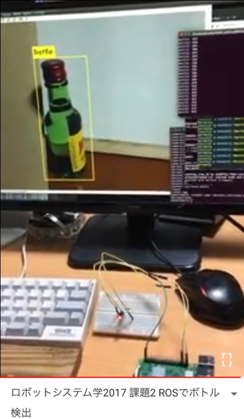
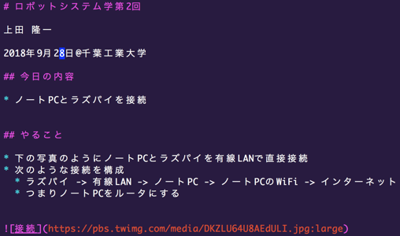
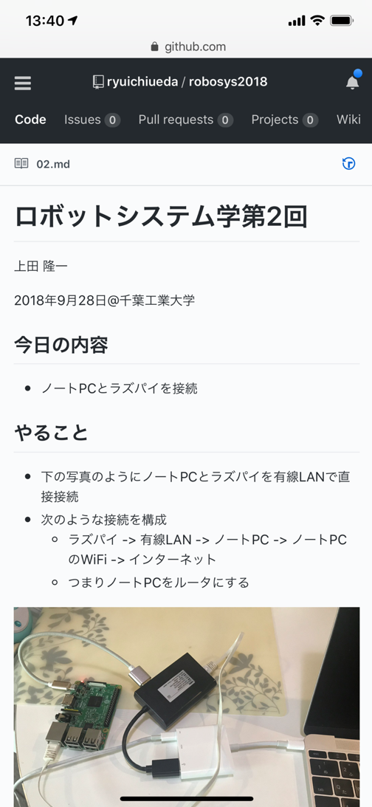
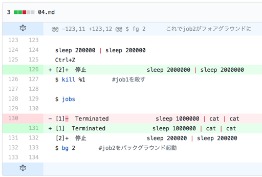
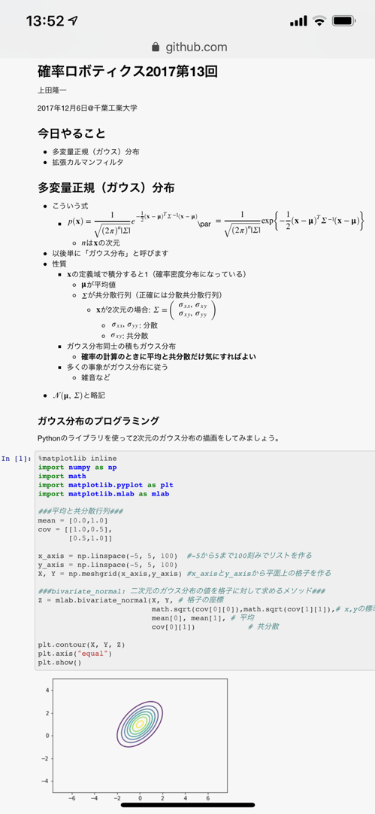

# 講義におけるウェブサービスやオープンソースソフトウェアの活用と課題

このテキストは、2018年11月26日に開催された、千葉工大のFD（Faculty Development）フォーラムの発表予稿を加筆修正したものです。

## 1. はじめに

　スマートフォン、タブレットPC、ノートPCは、情報を早く、効率よく得るために必須の道具となりつつあり、講義での利用促進も叫ばれている。特に、プログラミングの伴う講義（数学や制御などアルゴリズムを書いて理解できるものを含む）については、佐藤が[佐藤2018]で調査、報告したように、数式とコードをセットで学習することが効果的と主張する事例が、ここ数年見られるようになってきている。このようなタイプの講義の場合、数式を即座にコードで実行するためには手元にPCは必須となる。PCの使用/未使用での学習効果の差については、慎重な評価が必要であり、筆者がその優劣についてここに述べることはできない。しかし、講義を改善しようというときに、PCという道具を最初から利用しないという選択肢は、少なくとも筆者にとっては考えにくい。

　また、もっと卑近な話として、筆者は講義中に参考になるウェブサイトや自身の資料のURLを[Twitter](https://twitter.com/)に投稿しながら講義をしている。しかし、Twitterのユーザーが少ない年配向けのセミナーや、情報機器を机に置く文化がない高校などでの講義中にその方法が使えず、大変面倒な思いをすることがある。もちろん使えない人には様々な理由があり、講師側に配慮は必要である。しかし、単に使うことが面倒、あるいは何かそういうものを使うことは悪いという考えで使っていないのであれば、他に正当な理由もなく、講師や受講者自身の時間を奪っているだけである。また、受講者が遊ぶことを警戒して、講師が情報機器の使用を許さないのであれば、それは最適化を目指すべき工学系の学部において、遊ばない受講者に対して最適化と反対のものを教育していることになる。

　特に最近は、転職や仕事の依頼が儀礼的なやりとりより先にSNS上で決まってしまうなど交渉が高速化している。例えば、筆者の場合、大手出版社からの書籍の執筆依頼がTwitterで来て受けた事例がある。大学生もインターネット上での連絡（電子メールではなくチャットやSNS）に慣れていると大きな武器の一つとなる。「失礼のない電子メールの書き方」ももちろん大切であり、筆者も指導をしている。しかし、武士が名乗りを挙げている最中に急襲された元寇の例（第一次世界大戦でも騎兵隊と塹壕中のマシンガン部隊の間で同様のことが起こった）を考えると、学生にはまずは最新のものを使って速さを優先してほしいと筆者は考えている。言葉遣いにしても、スピード命のチャットでの会話で、教員に対して学生が常に慇懃な態度を取っていると、会話が中断している間に他の用事が入り、意思決定が何時間も後ろ倒しになることがある。無理にフランクにする必要はなく、言葉の誤用で失礼な場合には指導が必要であるが、リズムよくやり取りしているときは「先生のおっしゃることは本当でございましょうか？」ではなく「マ？」の方が適切である場合は、確実に存在する。

　筆者は学部3年生向けの「ロボットシステム学」と、大学院の「確率ロボティクス」を担当している。上記のような考えから、いずれもスマートフォンやノートPCの利用を前提として講義を組み立てている。また、それらの機器上で、多くのウェブサービスやオープンソースソフトウェアを利用している。本稿では、この二つの講義における情報機器やウェブサービスやオープンソースソフトウェアの利用方法を紹介する。

## 2. ロボットシステム学

### 2.1 講義の内容

　ロボットシステム学は、ロボットに関係の深いソフトウェアや、ソフトウェアによるハードウェアの制御について扱う講義である。学生に1人1台、シングルボードコンピュータ「[Raspberry Pi](https://www.raspberrypi.org/)」とノートPCを講義に持参してもらい、PCからRaspberry Piに接続して実際にソフトウェアの挙動を確認しながら講義を進めている。

　扱う主な題材はLinuxオペレーティングシステムの基礎からデバイスドライバの作成、[ROS](http://www.ros.org/)（ロボットオペレーティングシステム）である。さらに、これらを使いこなし、自身の存在や作品をアピールするためにはインターネット上のサービスやリソースを使いこなす必要がある。そのため、ソースコードの共有プラットフォームサービスであるGitHubの使い方、さらにはソフトウェアライセンスや著作権についても扱っている。

### 2.2 課題の提出はGitHubとYouTubeに

　講義では例年、ハードウェアを動作させる課題を2つ課している。コードを[GitHub](https://github.com/)、動作させている様子を撮影した動画をYouTubeあるいはTwitterのビデオに投稿して、電子メールで筆者にURLを伝えることで提出としている。図1に、提出された課題の例を示す。この際、GitHubへの提出物については、コード自体へのコメントの他に、著作権情報やライセンスの明示、ディレクトリ構造についても不備があれば指摘して再提出してもらっている。

**図1: 提出された課題の例（島田悟志: “ロボットシステム学2017 課題2 ROSでボトル検出”, https://www.youtube.com/watch?v=6AreTU5fd1U/ ）**

　現在は、優れたロボットを開発した場合、YouTubeにデモンストレーションムービーを投稿することが世界的に常識となっている。一方、どんなに大掛かりな実験をしたり、大きなイベントに出展したりしても、インターネットを公表に使わないことで、優れた成果が埋れてしまうことも多い。学生に少しでもYouTubeやGitHubの経験があれば、将来そのような不幸の頻度を減らすことができる。

　また、講義では一般に、人の提出した課題をコピーするなという指導が行われているが、本講義では、ライセンス、著作権を守っていればコピーすることを推奨している。ただし、ライセンス、著作権を守っていない場合は受理せず、守っていてもコピーした状態からの追加分がないと高い点は得られない。これは、筆者が学生時代にロボカップ（ロボットサッカーワールドカップ）に参加していたときの苦い経験が動機になっている。筆者は当時、ソフトウェアライセンスに詳しくなく、情報系のチームが行っているソフトウェアのコピーに抵抗を感じていた。その結果、なんでも独自にソフトウェアを作ろうとしてしまい、他チームに遅れをとってしまった。これは結局、社会のルールを調査せず、自身で善悪やモラルでやってはいけないことを判断してしまった失敗であり、学生にはそのようなことのないようにという趣旨のことを講義では述べている。

### 2.3 テキストはGitHub上で公開

　オープンソースソフトウェアを利用、作成するという講義の性質上、講義資料もGitHub上に公開している。GitHubでは、図2のようにマークダウン形式で記述されたテキストが、図3のようにフォーマットされて表示される。講義はこの画面をスクリーンに表示して進行している。

**図2: 講義資料の原稿**

**図3: 図1のテキストをGitHub上（iPhone）で閲覧**

　GitHubで講義資料を公開する最大のメリットとして、「Pull requests」という仕組みを利用してTAや学生が資料の修正案を講師にフィードバックできることである。学生側で資料を修正してPull requestを講師側に投げると、講師側で図4のように変更点が確認でき、修正が妥当だと判断すれば修正を反映（マージ）できる。このように公開した状態で修正の心理的閾値を下げておくことで、資料を講師だけの責任でなく講義への参加者全員で良くする意識が発生することを狙っている。ただし、積極的に修正を行うような学生は各学年に1人いるかどうかであるので、修正が受理された場合に成績を加点するなどのインセンティブを設けている。

**図4: GitHub上でPull requestの確認**

　一方、GitHub+マークダウン形式の資料を使うことは、PowerPointなどを利用してスライド形式で作った資料と比べて、話すときにメリハリがつかないことが弱点である。GitHubでもスライドのように資料を提示することは可能である。しかし、学生があとで見返すときにはスライド形式よりも上から下に読めるノート形式の方がよいので、利用はしていない。

## 3. 確率ロボティクス

　「確率ロボティクス」は、情報が不確かな環境下でロボットに環境認識、行動させるためのアルゴリズムを扱う講義である。この講義では多次元空間中の確率分布同士の演算などイメージしにくい演算を扱う。そのため、単に数式を書いて示すだけではなく、プログラムを書いて動かしてもらい、イメージを把握してもらうことが重要となる。

### 3.1 Jupyter Notebook

　そのためのツールとして、この講義では「[Jupyter Notebook](http://jupyter.org/)」というソフトウェアを使用している。Jupyter Notebookは「ノートブック」と呼ばれる一つのファイルでドキュメントの閲覧とプログラムの閲覧、実行ができるツールであり、講義資料を「プログラムが動くドキュメント」として提供できる。ノートブックはウェブブラウザ上で開いて編集することができ、特別なエディタは不要である。図5はJupyter Notebook上で、マークダウン形式やLaTeXの数式モードでドキュメントや数式を記述して、さらにその下でプログラミングして結果を表示している例である。ノートブックのフォーマットはGitHub側も対応しており、GitHub上でもフォーマットされたノートブックを閲覧できる。

**図5: ノートブックの例**

### 3.2 その他

　他は、テキストをGitHub上に置くなど、ロボットシステム学と同様の方法をとっている。確率ロボティクスは大学院の講義であり、学生と筆者の距離が近いためノートブック中の式や言葉遣いが間違っているという指摘が気軽に入るようになっており、昨年はPull requestが何件かあった。GitHub上の講義資料をまとめて出版することになったので、残念ながら本年度からはコードのみをGitHubで公開している。昨年度までの資料はそのまま公開している。

## 4. 課題と考察

### 4.1 インターネット上での質問が未だ少ない

　課題の提出に加え、質問も、なるべくインターネット上で誰からも閲覧できるところで行うように学生にはお願いしている。具体的にはTwitterでハッシュタグ（ロボットシステム学は#probrobo2018、確率ロボティクスは#probrobo2018）付きで質問するように推奨している。特にロボットシステム学については、Raspberry Piのセットアップや通信設定などがうまくいかない場合が多く、年々設定の方法も日々変わるため、情報共有は重要となる。このようにパブリックに連絡をとる狙いは、疑問と回答を学生間やその周辺で共有することで共有の知識とするためである。また、筆者自身の教育における活動をインターネット上に残しておくことも意図している。

　一方、質問のやりとりはインターネット上で筆者が考えている頻度を下回っている。これは学生側に原因を求めがちな話であるが、上記のように筆者にも狙いがあるため、筆者が工夫をしなければならないと考えている。研究室の学生に協力してもらうなど、ハッシュタグが閑散としないような対策が必要である。

### 4.2 ツール選びについて

　サービスやソフトウェアを利用する場合、学生の利便性ではなく、教員の趣味趣向や組織や教員の都合が優先されることがしばしば起こる。しかしこのようなことは、インターネット上に解説が少ない中で利用しないものの利用方法を学習させることとなり、学生の負担となるため、なるべく避けなければならない。

　また、質問やコメント、その他講義に関する雑談は、講義専門の閉じたシステムよりも、普段学生が使っているSNSなどで受け付ける方がスマートフォン上での操作が少なくて済むと考えている。ネット通販等のサイトが、利用者のクリック数を極限まで減らす努力をしている中で、講師側がそのように最適化されていないシステムの利用を強制するよりは、SNSのように投稿を促す仕組みを備えたものを利用した方がよいと考えている。

　ただ、あるソフトウェアがメジャーなのかマイナーなのかは主観で判断されることが多く、属する学会やコミュニティー、普段利用するオペレーティングシステムで変わってしまう。この主観を押し付けないように、講義の中で何かツールを利用する場合は、必ずそれが世の中でどう使われているのかを説明し、使用に長けるとメリットがあることを説明するようにしている。

### 4.3 不用意なアップロード

　課題の提出時、YouTubeのタイトルやGitHub上のドキュメントに学籍番号を書いてしまう事故がよく起こるため、こまめに修正を依頼している。これは不用意に個人情報を公開してしまっているという問題の他に、課題とは言え、第三者に全く意味のないうちわの情報をパブリックにアップロードしてしまうセンスの問題もある。講義ではインターネット上にものを置くことは他人にプレゼンテーションすることであると強調しているが、全員が理解できるわけではないので、今後も細かいケアが必要であると覚悟している。

　また、講義では全く強制はしないものの、なるべく実名、あるいはハンドルネームを技術力や表現力で有名になってもらうよう努力を促しているが、これも事故がないとは言い切れない。しかし、インターネット上が社会の一角を占める現在の状況で、そこへ積極的に参加を促さないのは、街に出ると危ないから家に閉じこもっているように指導することとほぼ同義である。適切にリスクコントロールしながら「ネット上で目立て」と学生諸氏の背中を押していく方針である。

## 5. おわりに

　筆者の講義で利用しているソフトウェアやインターネット上のサービスについて説明した。また、現状で課題となっていることについて述べた。導入したものと、その狙いをまとめると次のようになる。

* YouTube、GitHub: 学生が自身の作品を世界に向けて公開できるようにする。
* Twitter: 素早く、知識を共有しながら連絡をとる。
* Jupyter Notebook: 数式とコードから講義の内容を理解する。

冒頭にも述べたように、特に成長している企業においては、情報収集や判断のスピードがSNS以前よりも高速化している。どのソフトウェアやサービスが良いか悪いかという議論も重要であるが、学生も教員も、常日頃から効率の良い方法を追い求める姿勢が今後重要と考えている。

## 参考文献

* [佐藤2018] 佐藤大亮: 確率ロボティクスのアルゴリズム理解を助けるオープンアクセスなサンプルコードと解説の作成, 平成29年度卒業論文, 千葉工業大学.

3)	Raspberry Pi: https://www.raspberrypi.org/
(last visit: 2018-11-06)
4)	ROS: http://www.ros.org/ (last visit: 2018-11-06)
5)	GitHub: https://github.com/ (last visit: 2018-11-06)
7)	Jupyter Notebook: http://jupyter.org/ (last visit: 2018-11-06)

