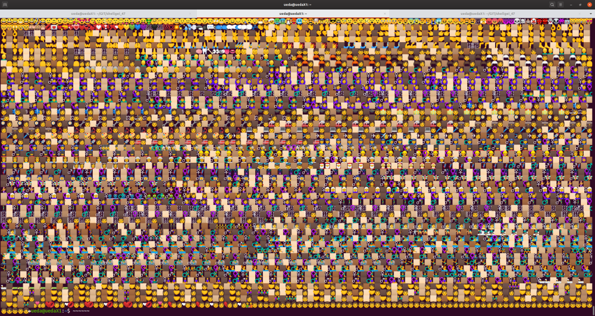

# 【問題と解答】jus共催 第47回引きこもりシェル芸勉強会

* 問題で使われているデータファイルは[GitHub](https://github.com/ryuichiueda/ShellGeiData/tree/master/vol.47)にあります。クローンは以下のようにお願いします。

```bash
$ git clone https://github.com/ryuichiueda/ShellGeiData.git
```


* 環境: 解答例はUbuntu Linux 19.10 で作成。Macの場合はcoreutilsをインストールすると、GNUのコマンドが使えます。BSD系の人は玄人なので各自対応のこと。


## Q1

次の`nums`ファイルについて、

```
$ cat nums
1, 3-5, 8, 10, 13-18, 20
```

次のようにハイフンで省略されている数字を復元してください。

```
1, 3, 4, 5, 8, 10, 13, 14, 15, 16, 17, 18, 20
```

### 解答例

```
$ cat nums | sed 's/[0-9]*-[0-9]*/{&}/g' |
sed 's/-/../g' | sed 's/^/echo /' | bash
1, 3, 4, 5, 8, 10, 13, 14, 15, 16, 17, 18, 20
```

## Q2

次のファイルについて、文字を並び替えるとちょうどウポポイになる行の行番号を出力してください。

```upopoi
ウポポイ
ウポイア
ウイポポポ
ワポイイ
ポパイ
ウホホイ
ウポイポ
ポウイポ
ポポウイ
ウンコ
ウポイいいいいポ
ポポウウ
ウポポポポ
ウポッ！いいポポポ
```

### 解答例

```
$ cat upopopi |
awk -F "" '{for(i=1;i<=NF;i++)a[i]=$i}{asort(a,b);for(i=1;i<=NF;i++)printf b[i];print ""}' |
grep -n "^イウポポ$"
1:イウポポ
7:イウポポ
8:イウポポ
9:イウポポ
```
## Q3

次の`noguruguru`ファイルについて、

```noguruguru
┃┃┗━━━┛┃┃
┗━━━━━━━┛
┃┃┏━━━━┓┃
┃┗━━━━━┛┃
┃┏━━━━━━┓
```

次のように並び替えてください。行番号は使わないでください。

```guruguru
┃┏━━━━━━┓
┃┃┏━━━━┓┃
┃┃┗━━━┛┃┃
┃┗━━━━━┛┃
┗━━━━━━━┛
```

### 解答例

```
$ cat noguruguru | sed 'y/┃┗┏━/5906/' | sort | sed 'y/5906/┃┗┏━/'
┃┏━━━━━━┓
┃┃┏━━━━┓┃
┃┃┗━━━┛┃┃
┃┗━━━━━┛┃
┗━━━━━━━┛
```

## Q4


479は9つの連続した素数の和で表せます。この9つの素数を出力してください。
　
<blockquote class="twitter-tweet" data-partner="tweetdeck"><p lang="und" dir="ltr"><a href="https://t.co/wzilaKVKKi">https://t.co/wzilaKVKKi</a></p>&mdash; くおん (@qwertanus) <a href="https://twitter.com/qwertanus/status/1242016369324875781?ref_src=twsrc%5Etfw">March 23, 2020</a></blockquote>
<script async src="https://platform.twitter.com/widgets.js" charset="utf-8"></script>


### 解答例

```
$ seq inf | factor | awk 'NF==2{print $2}' | xargs | awk '{for(i=1;;i++){for(j=i;j<i+9;j++)printf $j" ";print ""}}' | awk '{print $1+$2+$3+$4+$5+$6+$7+$8+$9}'  | grep -m 1 ^479
```

## Q5

次のファイル`unko`について

```
$ cat unko 
💩

        💩  
      💩
　　　💩
🚽  　　　💩
🚽
  💩　　　
        　　
💩💩💩💩🚽💩　　

```

次のように、浮いている💩と🚽を落としてください。もしかしたら環境によって💩の位置がずれるかもしれませんので、端末の出力に基づいて各自の解釈でやってください。

```
💩　　　　　　　
🚽　　💩　　　　
🚽💩　💩💩💩　　
💩💩💩💩🚽💩
```

### 解答例

```
$ cat unko | sed 's/[   ]/@/g' | sed 's/　/@@/g' |
sed 's/@@/＠/g' | awk -F "" '{for(i=1;i<=NF;i++)
{if($i=="💩" || $i=="🚽")a[i]=a[i]$i}}
END{for(i=1;i<=10;i++){print a[i]}}' |
awk '{printf("%04s\n",$1)}' | sed 's/ /　/g' |
awk -F "" '{for(i=1;i<=NF;i++){a[i][NR]=$i}}
END{for(i=1;i<=8;i++){for(j=1;j<=8;j++)printf a[i][j];print ""}}'
```

## Q6

次の画像のように、異なる種類の絵文字で画面を埋めてください。



画像のように肌の色などの出力は乱れても構いません。必要なら

```
$ sudo apt install unicode-data
```

して`/usr/share/unicode/`下のデータを使ってください。


### 解答例

```
$ cat /usr/share/unicode/emoji/emoji-test.txt | grep -v '^#' |
sed 's/.*#//' | LANG=C tr -d '[:print:]\n'
```

## Q7

次の`spaces`ファイルについて、どの種類のスペースがいくつずつ含まれるのか、リストを作ってください。

```
$ cat spaces
    　　　　　　
 
         
    
     
     
        


```

### 解答例

```
$ cat spaces | nkf -w16B0 | xxd -ps | fold -b4 | sort |
uniq -c | tr a-f A-F | awk '{print $2,$1}' |
join -1 1 -2 1 - <(tr ';' ' ' < /usr/share/unicode/UnicodeData.txt | sort) |
grep -o '.*SPACE'
0020 21 SPACE
2002 4 EN SPACE
2003 1 EM SPACE
2004 1 THREE-PER-EM SPACE
2005 2 FOUR-PER-EM SPACE
2007 2 FIGURE SPACE
2008 4 PUNCTUATION SPACE
200A 6 HAIR SPACE
200B 1 ZERO WIDTH SPACE
3000 6 IDEOGRAPHIC SPACE
```

## Q8

次の文字列からアクセントをとってピュアなunkoにしてください。（単純にúをuに置換するという解はダメです。）

```
úńķô
```

### 解答例

```
$ echo úńķô | iconv -f utf8 -t ucs-2be | xxd -ps |
fold -b4 | sed 's/.*/^\U&/g' |
xargs -I@ grep @ /usr/share/unicode/decomps.txt |
awk -F '[; ]' 'BEGIN{printf "echo -e "}{printf "\\\\U"$3}' | bash
unko
```

```
$ echo úńķô | grep -o . | opy '[unicodedata.name(F1)]' |
sed 's/.*/\L&/g' | awk '{printf $4}END{print ""}'
unko
```
