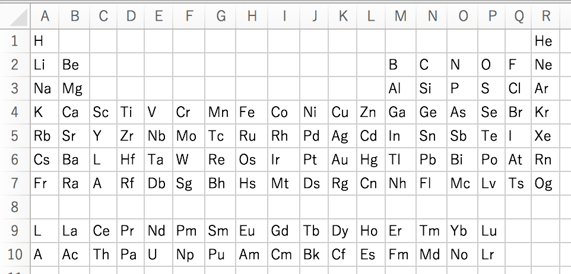

# 【問題と解答】jus共催 第31回朝からだと疲れるから午後からでええじゃろシェル芸勉強会

* 問題で使われているデータファイルは[GitHub](https://github.com/ryuichiueda/ShellGeiData/tree/master/vol.31)にあります。クローンは以下のようにお願いします。

```bash
$ git clone https://github.com/ryuichiueda/ShellGeiData.git
```

* 環境: 解答例はUbuntu Linux 16.04 で作成。Macの場合はcoreutilsをインストールすると、GNUのコマンドが使えます。BSD系の人は玄人なので各自対応のこと。

<iframe src="//www.slideshare.net/slideshow/embed_code/key/EPiUqB6tfuEzRX" width="595" height="485" frameborder="0" marginwidth="0" marginheight="0" scrolling="no" style="border:1px solid #CCC; border-width:1px; margin-bottom:5px; max-width: 100%;" allowfullscreen> </iframe> <div style="margin-bottom:5px"> <strong> <a href="//www.slideshare.net/secret/EPiUqB6tfuEzRX" title="第31回シェル芸勉強会スライド" target="_blank">第31回シェル芸勉強会スライド</a> </strong> from <strong><a href="https://www.slideshare.net/ryuichiueda" target="_blank">隆一 上田</a></strong> </div>

## Q1 

次の[num.txt](num.txt)について、1の直前にある数字をすべて削除してください。このルールでは、改行を無視します。つまり、次の行の先頭が1のときは、前の行の最後の数字を削除します。

```bash
$ cat num.txt
1214235325231
325316321345
135326547361
414353515325
```
### 解答

前回の午前の部のおさらいでした。ルックアラウンドアサーションと行またぎの置換を利用します。

```bash
$ cat num.txt | perl -0 -pe 's/.(\n)?(?=1)/\1/g'
11423532521
325163134
13532654731
1435315325
```


## Q2

次のファイル[indent.txt](indent.txt)について、インデントのついていない行を、上の行のインデントに合わせてください。

```indent.txt
$ cat indent.txt
  * aa
* bbb
         * cccccc
* ddd
      * eeeeeeeeee
* fff
   * gggg
* hhh
```

### 解答

```bash
$ cat indent.txt | awk '/^ /{print ; s = gensub(/[^ ].*$/,"",1)}/^[^ ]/{print s $0}'
  * aa
  * bbb
         * cccccc
         * ddd
      * eeeeeeeeee
      * fff
   * gggg
   * hhh
```

## Q3

次のような出力を作ってください。

```
********************
*@******************
**@*****************
********************
****@***************
********************
******@*************
********************
********************
********************
**********@*********
********************
************@*******
********************
********************
********************
****************@***
********************
******************@*
********************
```

### 解答

awkのgensubを使うとマッチした回数を使って狙ったところを置換できます。

```bash
seq 20 | factor | awk '{a="********************"}NF!=2{print a}NF==2{print gensub(/./,"@",$2,a)}'
```

## Q4

ASCIIコードだけを使ったワンライナーで「おはようございます」と出力してください。手段は問いません。

### 解答

```bash
$ echo 44GK44Gv44KI44GG44GU44GW44GE44G+44GZCg== | base64 -d
おはようございます
$ w3m -dump http://eow.alc.co.jp/search?q=good+morning | nl |
grep 57 | tr -d ' \t0-9' | sed 's/^...//' | sed 's/\(.........\).*/\1/'
おはようございます
```

## Q5

2つの自然数の最小公倍数を求めるワンライナーを考えてください。


### 解答

他にもたくさん解法があると思います。

```bash
$ sort -mn <(echo 5 | awk '{for(i=1;;i++){print $1*i}}') <(echo 42 | awk '{for(i=1;;i++){print $1*i}}') |
uniq -d | head -n 1
210
```

## Q6

`echo あいうえお` から始めて `ぁぃぅぇぉ` をワンライナーで出力してください。

### 解答

```bash
$ echo あいうえお | xxd -p | sed 's/../0x&\n/g' | xargs printf "%d\n" |
awk 'NR%3==0{$1--}{print}' | xargs printf "%02x" | xxd -r -p
ぁぃぅぇぉ
```


## Q7

次のようなアニメーションを作ってください。

<iframe width="560" height="315" src="https://www.youtube.com/embed/BChVPQNDNe0" frameborder="0" allowfullscreen></iframe>

### 解答例

```bash
$ python -c 'print " "*20,"^"' | sed 'p;s; ^;/ \\;' |
awk 'NR==1{print}NR>1{print;while(1){$0=gensub(/ \//,"/ ",1);$0=gensub(/\\/," \\\\",1);print}}' |
awk '{system("sleep 0.5");print}NR>20{exit(0)}' 
```

## Q8

次のファイル[sd.txt](sd.txt)について、全角5文字で折り返してください。半角は0.5文字扱いで、ぴったり5文字で合わない時は4.5文字で折り返してください。

```sd.txt
Software Designの「シェル芸人からの
挑戦状」は絶好調なんですが、もう
ちょっとTwitterで読んだ感想を述べて
いただければと。
```

出力の例です。

```
Software D
esignの「
シェル芸人
からの挑戦
状」は絶好
調なんです
が、もうち
ょっとTwit
terで読ん
だ感想を述
べていただ
ければと。
```

### 解答

```bash
$ cat sd.txt | grep -o . |
LANG=C awk '{if(/[[:print:]]/){print 1,$1}else{print 2,$1}}' |
awk '{a+=$1;if(a>10){print "";a=$1}}{printf $2}NF==1{printf " "}' |
awk 1
```


## Q9

元素の周期表のCSVファイルを作ってください。



```csv
H,,,,,,,,,,,,,,,,,He
Li,Be,,,,,,,,,,,B,C,N,O,F,Ne
Na,Mg,,,,,,,,,,,Al,Si,P,S,Cl,Ar
K,Ca,Sc,Ti,V,Cr,Mn,Fe,Co,Ni,Cu,Zn,Ga,Ge,As,Se,Br,Kr
Rb,Sr,Y,Zr,Nb,Mo,Tc,Ru,Rh,Pd,Ag,Cd,In,Sn,Sb,Te,I,Xe
Cs,Ba,L,Hf,Ta,W,Re,Os,Ir,Pt,Au,Hg,Tl,Pb,Bi,Po,At,Rn
Fr,Ra,A,Rf,Db,Sg,Bh,Hs,Mt,Ds,Rg,Cn,Nh,Fl,Mc,Lv,Ts,Og

L,La,Ce,Pr,Nd,Pm,Sm,Eu,Gd,Tb,Dy,Ho,Er,Tm,Yb,Lu
A,Ac,Th,Pa,U,Np,Pu,Am,Cm,Bk,Cf,Es,Fm,Md,No,Lr
```


### 解答

```bash
$ w3m http://www.gadgety.net/shin/trivia/ptable/ -dump |
grep -E '(H|Li|Na|K|Rb|Cs|Fr|La|Ac)' |
awk 'NR<=9' | sed 's/ラ/ L/' | sed 's/    /@@ |/g' |
sed 's/   /@@ /g' | tr -d '│|' | sed 's/^  *//' |
sed 's/  */,/g' | tr -d @ | sed -e 's/,La/\nL&/' -e 's/,Ac/A&/' |
sed 's/^,//' | sed 's/,*$//' > periodic_table.csv
```


